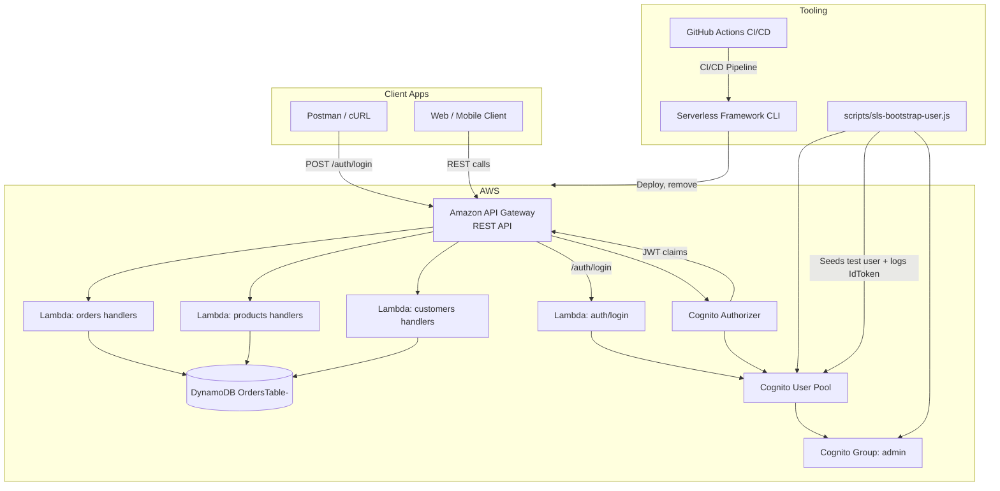
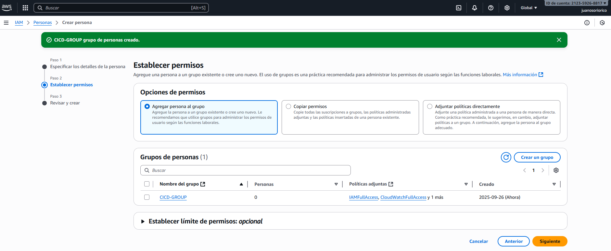
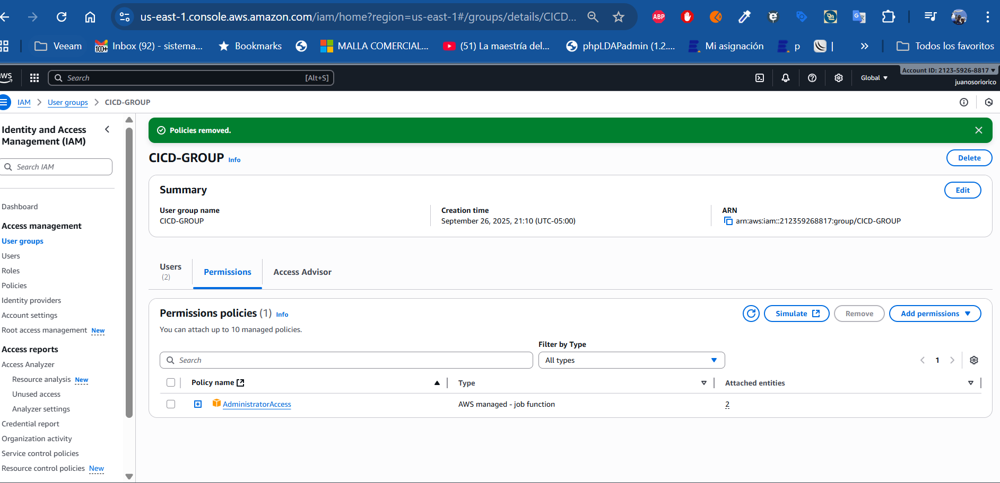
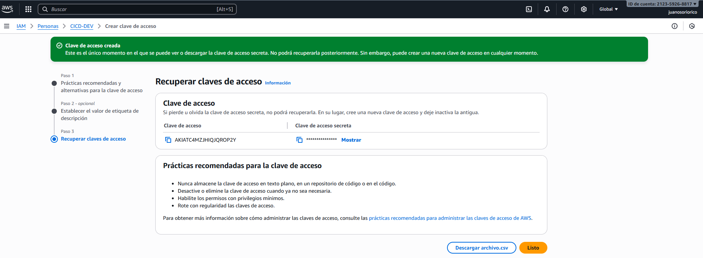
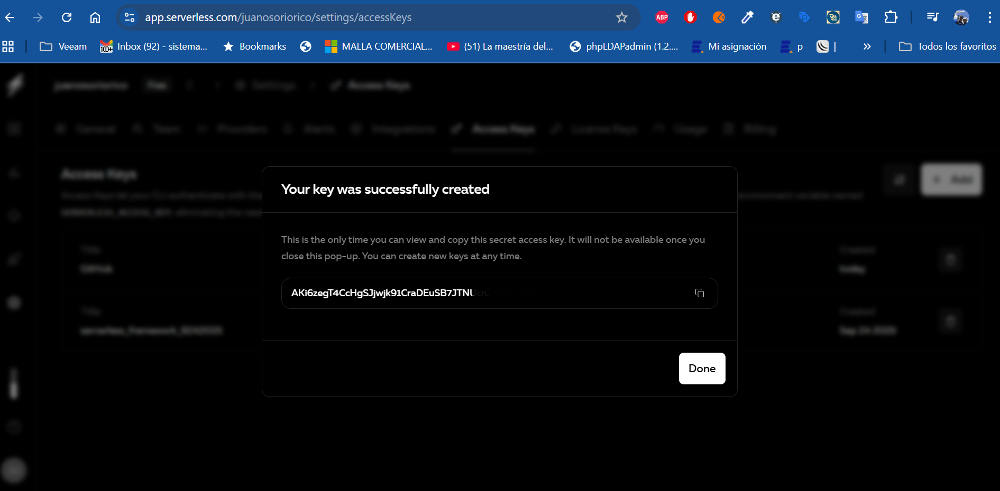
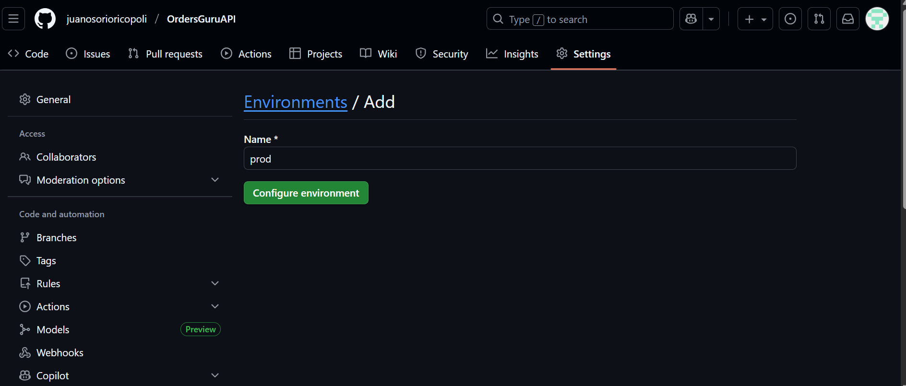
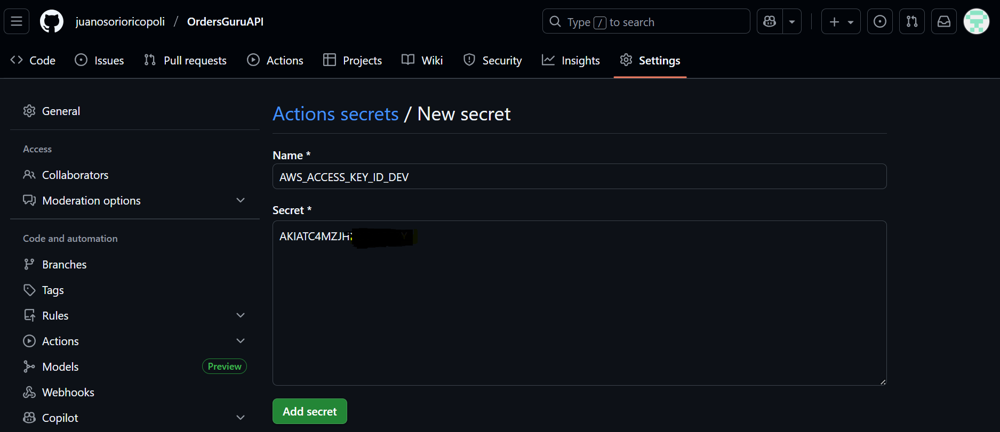
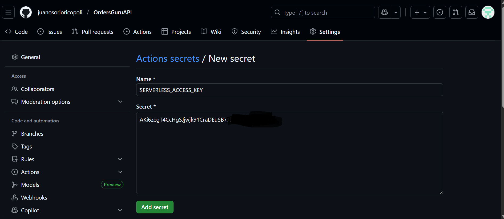

# Orders API (Serverless + Cognito Auth)

REST API for orders, products, and customers built on **AWS Lambda**, **API Gateway REST v1**, **DynamoDB**, and protected by **Amazon Cognito** using the Serverless Framework.

## Architecture
- API Gateway routes to Node.js 20 Lambda functions packaged with Serverless Framework v3.
- A single DynamoDB table stores all entities; GSIs `byEntityCreatedAt` and `byOwnerCreatedAt` back list queries.
- Cognito User Pool + API Gateway authorizer enforce JWT auth; the `admin` group guards privileged endpoints.
- `scripts/sls-bootstrap-user.js` seeds a test user after each deploy and prints a usable IdToken.
## AWS Architecture Diagram



## Project Structure
```
OrdersGuruApi/
  serverless.yml
  package.json
  src/
    handlers/
      auth/
        login.js
      orders/
        create.js
        get.js
        list.js
        remove.js
        update.js
      products/
        create.js
        get.js
        list.js
        remove.js
        update.js
      customers/
        create.js
        get.js
        list.js
        remove.js
        update.js
    lib/
      auth.js
      ddb.js
      http.js
    validators/
      orders.js
      products.js
      customers.js
  scripts/
    sls-bootstrap-user.js
  config_cicd/
  .github/
    workflows/
      deploy.yml
  orders-api.postman_collection.json
  README.md
```

## Prerequisites
- AWS account with rights for CloudFormation, IAM, DynamoDB, API Gateway, Lambda, and Cognito.
- IAM role/user with access keys configured locally (`aws configure`).
- `serverlessApiGatewayCloudWatchRole` IAM role (trusted entity `apigateway.amazonaws.com`) with policy `AmazonAPIGatewayPushToCloudWatchLogs` so API Gateway can ship logs.
- Node.js 20+ and npm.
- Serverless Framework (`npm i -g serverless`).

## Local Deployment
Install dependencies:
```bash
npm ci
```

Deploy stages:
```bash
# Dev
npx serverless deploy --stage dev

# Prod
npx serverless deploy --stage prod
```

Useful CloudFormation outputs:
- `ApiUrl`
- `UserPoolId`
- `UserPoolClientId`
- `TableName`

Remove stacks:
```bash
npx serverless remove --stage dev
npx serverless remove --stage prod
```

## Cognito Bootstrap User
The bootstrap plugin creates `juan@example.com` with password `P@ssw0rd!` and adds it to the `admin` group. Override defaults with `--username`, `--password`, or `--admin=false`. Copy the `AuthenticationResult.IdToken` from the deploy logs and use it as a Bearer token.

## Authentication via API
- `POST /auth/login` Generates IdToken, AccessToken, and RefreshToken using AWS Cognito. Send `{"username":"<email>","password":"<password>"}`and receives tokens ready for the rest of the requests.
- Send alone `{"refreshToken":"<token>"}` To rotate credentials without resending the password; the function reuses the refresh token if Cognito doesn't deliver a new one.
- The Lambda function in `src/handlers/auth/login.js` It does not require an authorizer, so it can be consumed from web clients or scripts..
- `USER_POOL_CLIENT_ID` and `USER_POOL_ID` are injected as environment variables from CloudFormation for this handler.

## Domain Validations
- **Products**: require `name`, `price`, and unique `sku` (case-insensitive). Only `admin` can mutate.
- **Customers**: require `name` and unique `email`. Owners (`ownerSub`) may update; delete is admin-only.
- **Orders**: require an existing `customer.id` and a list of products `{ sku, qty }` with existing SKUs (no duplicates per order).

Validators located in `src/validators/*` query DynamoDB before persisting changes.

## DynamoDB Item Shape
```json
{
  "id": "uuid",
  "entity": "ORDER|PRODUCT|CUSTOMER",
  "ownerSub": "cognito-sub",
  "createdAt": "ISO-8601",
  "customerId": "string",
  "products": [{ "sku": "string", "qty": 1 }],
  "productSkus": ["string"],
  "status": "NEW|PAID|CANCELLED",
  "total": 16000,
  "notes": "optional",

  "name": "string",
  "price": 6000,
  "sku": "string",
  "description": "optional",
  "email": "string",
  "phone": "optional",
  "address": "optional",
  "active": true
}
```

## CI/CD with GitHub Actions
Workflow: `.github/workflows/deploy.yml`

### Triggers
- Push to `dev` -> deploy `--stage dev`.
- Push to `master` -> deploy `--stage prod`.
- Manual `Run workflow` button -> choose `dev` or `prod` via the `environment` input.

### Required GitHub Secrets
Create these repository-level secrets:
- `AWS_ACCESS_KEY_ID_DEV` / `AWS_SECRET_ACCESS_KEY_DEV`
- `AWS_ACCESS_KEY_ID_PROD` / `AWS_SECRET_ACCESS_KEY_PROD`
- `SERVERLESS_ACCESS_KEY`

### Manual Deployment
1. Go to **Actions > Orders API CI/CD > Run workflow**.
2. Select the branch (usually `master`) and choose `dev` or `prod` in the dropdown.
3. Click **Run workflow**. Only the job for the selected environment runs.

### AWS Notes
- Ensure the IAM principals referenced by the secrets have the necessary permissions.
- If deploying in a fresh account, create the `serverlessApiGatewayCloudWatchRole` once or add it to `serverless.yml`.

### Step by step with CI/CD figuration

1. Create users in the AWS console:
In the IAM service of the AWS console, go to the Users menu and create 2 users for each environment (dev, prod)



2. Create a group and assign the permission (AdministratorAccess), then assign this group to the users created in the previous step.



3. Enter each created user, go to security credentials and create an Access key, select the Command Line Interface (CLI) use case, when you finish the steps save the Access Key and Secret Key, this will be important in subsequent steps.



4. Log in to your account at https://app.serverless.com/ and go to Settings -> Access Keys.
Add a name and save the access key; This will be important in the following steps.



5. In your GitHub account, in the project repository, go to the settings->environments menu and create two environments (dev, prod).



6. Configure the secrets in GitHub, go to the settings menu - Secrets and variables - Actions and click on new repository secret.

Create the following secrets:
- AWS_ACCESS_KEY_ID DEV
- AWS_SECRET_ACCESS_KEY DEV
- AWS_ACCESS_KEY_ID PROD
- AWS_SECRET_ACCESS_KEY PROD
Entering the secrets created in the AWS console in step 3



Create the secret
- SERVERLESS_ACCESS_KEY
Using the Serverless platform Access Key in step 4



## Postman Collection
`orders-api.postman_collection.json` agrupa solicitudes con variables de coleccion (`idToken`, `customerId`, `productId`, etc.) para validar el API.
- La carpeta **Auth** incluye `Auth - Login`, que popula automaticamente `idToken`, `accessToken` y `refreshToken` en la coleccion.
- Ejecuta ese request tras cada despliegue para refrescar credenciales y reutiliza las variables en los demas folders.

## Quick cURL Example
```bash
API_URL="https://<restid>.execute-api.us-east-1.amazonaws.com/dev"
USERNAME="juan@example.com"
PASSWORD="P@ssw0rd!"
CUSTOMER_ID="<existing customer id>"

TOKEN=$(curl -s -X POST "$API_URL/auth/login" \
  -H "Content-Type: application/json" \
  -d '{"username":"'$USERNAME'","password":"'$PASSWORD'"}' | jq -r '.idToken')

curl -X POST "$API_URL/products" \
  -H "Authorization: Bearer $TOKEN" \
  -H "Content-Type: application/json" \
  -d '{"name":"Latte 12oz","price":6000,"sku":"0001"}'

curl -X POST "$API_URL/customers" \
  -H "Authorization: Bearer $TOKEN" \
  -H "Content-Type: application/json" \
  -d '{"name":"Juan Perez","email":"juan.perez@example.com"}'

curl -X POST "$API_URL/orders" \
  -H "Authorization: Bearer $TOKEN" \
  -H "Content-Type: application/json" \
  -d '{
        "customer": { "id": "'$CUSTOMER_ID'" },
        "products": [
          { "sku": "0001", "qty": 2 }
        ],
        "total": 12000,
        "status": "NEW"
      }'
```

## Notes
- Node.js 20 already bundles AWS SDK v3; `aws-sdk` v2 is used for DynamoDB DocumentClient compatibility.
- For local development against DynamoDB Local, adjust `lib/ddb.js` to point to the local endpoint.
- The `pipeline/` folder contains CloudFormation and CodeBuild definitions if you prefer AWS CodePipeline instead of GitHub Actions.

## Explanatory Videos

- Project explanation https://www.loom.com/share/fa0261c675054a31aa02134d70117c8f?sid=a05bc1c3-8b5f-4e9e-b437-39fb32dfbfa1

- Explanation of code and validations https://www.loom.com/share/9f24eec5233846e4b11e7b8a867f5593?sid=c4b29328-0691-493f-808a-aefe39de26bb

- Explanation of code serverless.yml https://www.loom.com/share/8a6aff52fbb241c7a0eff692532a1a8c?sid=316b2951-31e1-41a3-b541-b9de713ca622

- Deployment of test environment and API testing https://www.loom.com/share/fd4b7127ce1f4d0ba8adfaaf9656e4f8?sid=57a4aa06-2c5d-46a0-844e-6930af3814ae

- Deploying a prod environment with GitHub Actions https://www.loom.com/share/8e5191c27280471fb3973b58be83f64f?sid=3a487bae-ccdf-4b3a-8c95-0bd211a3d1ab


